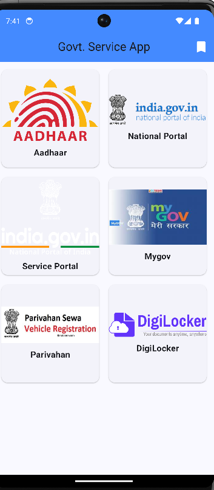
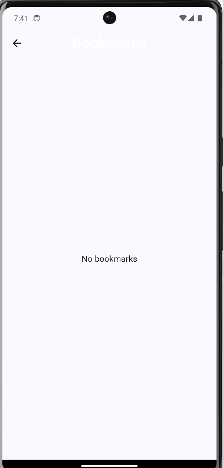
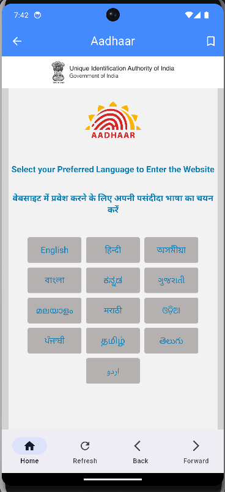
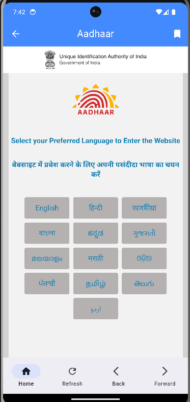
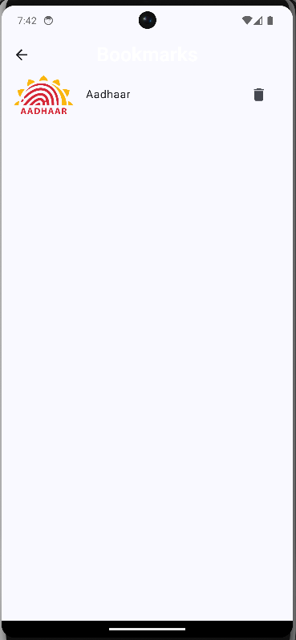

Government Service App 📲

A Flutter application that provides a seamless in-app browsing experience for accessing various government services using the InAppWebView Controller. This app allows users to navigate web pages, refresh content, and manage bookmarks for easy access to important services.

Features 🚀

In-App WebView: Browse government service websites within the app using flutter_inappwebview.
Pull to Refresh: Easily refresh web pages with a swipe gesture.
Bookmark Management: Add and remove bookmarks for frequently visited pages.
Bottom Navigation Bar: Navigate through the app with Home, Refresh, Back, and Forward options.
Modern UI: Simple and user-friendly interface.

Screenshots 📸

Tech Stack 💻

Flutter (Dart)
flutter_inappwebview for in-app web browsing
provider for state management
Material Design for UI
How to Use 🔧

Clone the Repository

bash
Copy
Edit
git clone https://github.com/yourusername/government-service-app.git
cd government-service-app
**Install Dependencies

You said:
readme file for government service app made with init web controller in flutter

Government Service App 📲
A Flutter application for accessing and navigating government services directly within the app using the InAppWebViewController. The app provides a seamless web experience with features like pull-to-refresh, navigation controls, and bookmark management.

Features 🚀

In-App WebView: Browse government service websites without leaving the app using InAppWebView.
Pull to Refresh: Easily refresh web pages with a pull gesture.
Navigation Controls: Move back, forward, or reload pages using a bottom navigation bar.
Bookmark Management: Add, remove, and manage bookmarks for your favorite services.
Dynamic Page Titles: Display the current page title in the app bar for a contextual experience.

Tech Stack 💻

Flutter
flutter_inappwebview for in-app web browsing
provider for state management
Material Design for a clean and modern UI
Installation and Setup 🔧
Prerequisites
Flutter SDK installed
Android Studio or VSCode
Dart enabled

Usage 🛠️
Homepage: Displays a list of government services.
Detail Page: Opens the selected service in a web view. Use the bottom navigation bar for navigation controls:
Home: Reloads the initial URL.
Refresh: Refreshes the current page.
Back: Goes back to the previous page.
Forward: Goes to the next page if available.

Contributing 🤝

Contributions are welcome! Feel free to submit a pull request or open an issue to improve the app.

Acknowledgements 🙏

flutter_inappwebview
Provider State Management
